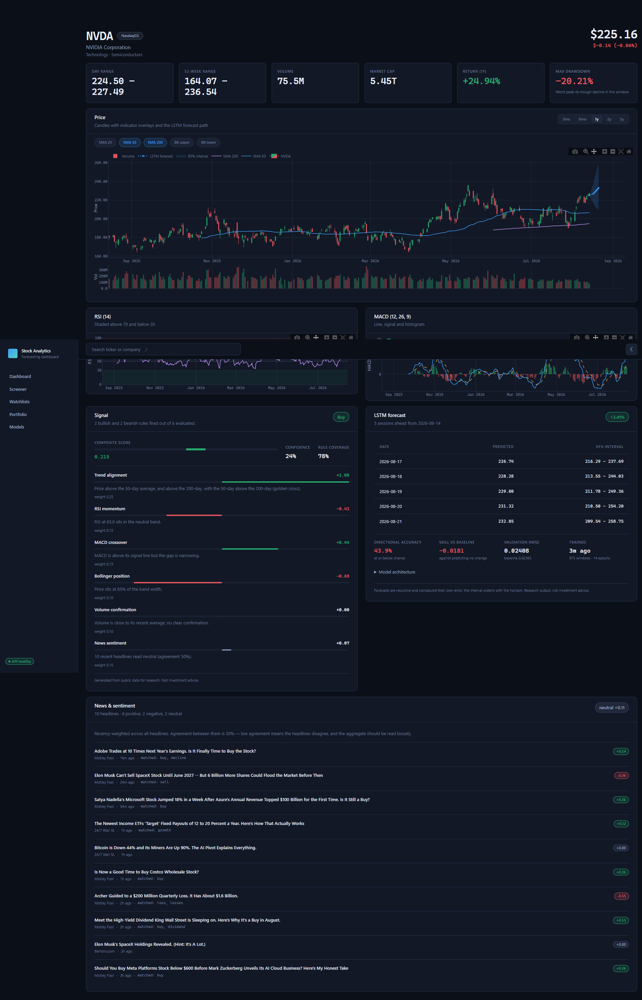
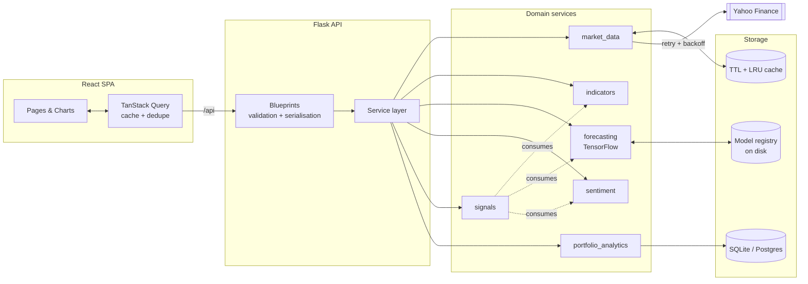
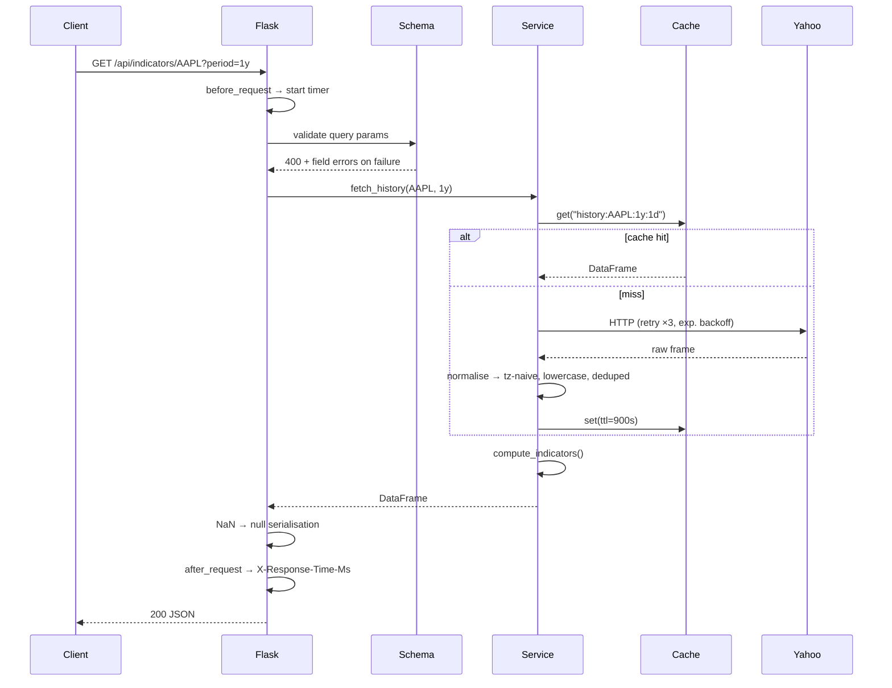

<div align="center">

# Stock Analytics & Forecasting Dashboard

**Technical analysis, LSTM price forecasting, news sentiment and portfolio tracking — built on live market data.**

[](https://www.python.org/)
[](https://flask.palletsprojects.com/)
[](https://www.tensorflow.org/)
[](https://react.dev/)
[](https://plotly.com/javascript/)
[](#testing)

**[Live UI preview](https://stock-analytics-forecasting.netlify.app)** · *interface only — see [Deployment](#deployment) for why the API needs a separate host*

</div>

---



---

## Contents

- [What it does](#what-it-does)
- [Quick start](#quick-start)
- [System architecture](#system-architecture)
- [**Backend deep dive**](#backend-deep-dive) ← the substance
  - [Request lifecycle](#request-lifecycle)
  - [1. Configuration](#1-configuration--environment-driven-not-hardcoded)
  - [2. Error handling](#2-error-handling--one-envelope-for-every-failure)
  - [3. Caching](#3-caching--because-yahoo-rate-limits-hard)
  - [4. Market data](#4-market-data--the-only-layer-that-touches-the-network)
  - [5. Technical indicators](#5-technical-indicators--pandas-not-ta-lib)
  - [6. The LSTM forecaster](#6-the-lstm-forecaster)
  - [7. News sentiment](#7-news-sentiment--a-lexicon-not-a-transformer)
  - [8. The signal engine](#8-the-signal-engine--rules-not-a-classifier)
  - [9. Portfolio analytics](#9-portfolio-analytics--derived-never-stored)
- [Measured model performance](#measured-model-performance)
- [API reference](#api-reference)
- [Testing](#testing)
- [Frontend notes](#frontend-notes)
- [Deployment](#deployment)
- [Limitations](#limitations)

---

## What it does

| Feature | Detail |
|---|---|
| **Charting** | OHLC candlesticks with volume, MA/Bollinger overlays, RSI and MACD panels. Indicator warm-up renders as gaps, not misleading flat lines. |
| **Indicators** | SMA, EMA, RSI, MACD, Bollinger, ATR, OBV, Stochastic, VWAP, rolling volatility, max drawdown, Sharpe. |
| **Forecasting** | Stacked LSTM per symbol predicting next-day log returns, extended recursively with widening confidence bands. |
| **Sentiment** | Finance-tuned lexicon over live headlines, with negation and intensifier handling, aggregated by recency. |
| **Signals** | Weighted rule engine → buy/sell/hold, with every rule's contribution and rationale exposed. |
| **Screener** | Runs the rule engine across a ticker list and ranks it. |
| **Portfolio** | Positions folded from an append-only trade log: cost basis, realised/unrealised P&L, allocation, equity curve, drawdown, Sharpe. |

Works on US and Indian markets — `AAPL`, `RELIANCE.NS`, `TCS.NS`, `^NSEI` all resolve, with correct currency rendering.

---

## Quick start

**Backend** (Python 3.11+):

```bash
cd backend
python -m venv .venv
source .venv/bin/activate          # Windows: .venv\Scripts\activate
pip install -r requirements.txt
flask --app wsgi run --debug --port 5000
```

**Frontend** (Node 18+):

```bash
cd frontend
npm install
npm run dev
```

Open <http://localhost:5173>. Vite proxies `/api` → Flask, so CORS never enters the picture locally. No API keys required.

Optional:

```bash
flask --app wsgi seed                      # demo watchlist
flask --app wsgi train AAPL MSFT --period 5y   # pre-train so first forecast is instant
```

---

## System architecture



The dependency direction is strict: **blueprints → services → storage**. Services never import Flask request objects, which is what makes them testable without a socket and reusable from the CLI.

---

# Backend deep dive

The backend is the bulk of the work. Roughly 3,000 lines across eleven modules, each with a single responsibility and a documented reason for existing.

```
backend/app/
├── __init__.py                 App factory, request hooks, CLI commands
├── config.py                   Environment-driven config, three profiles
├── errors.py                   Error taxonomy → one JSON envelope
├── extensions.py               SQLAlchemy + CORS singletons
├── schemas.py                  Marshmallow validation, NaN-safe serialisation
├── api/                        HTTP layer only — no business logic
│   ├── stocks.py               Quotes, history, search, news
│   ├── analysis.py             Indicators, forecasts, signals, screening
│   ├── watchlists.py           Watchlist CRUD
│   ├── portfolios.py           Portfolio CRUD + valuation
│   └── system.py               Health, cache stats, route index
├── models/                     SQLAlchemy 2.0 ORM
└── services/                   All domain logic
    ├── market_data.py          Yahoo access, retries, normalisation
    ├── cache.py                Thread-safe TTL + LRU
    ├── indicators.py           Technical indicators on pandas
    ├── sentiment.py            Lexicon scorer
    ├── signals.py              Weighted rule engine
    ├── portfolio_analytics.py  Position folding, valuation, equity curve
    └── forecasting/
        ├── dataset.py          Features, scaling, windowing
        ├── model.py            Keras architecture + metrics
        ├── registry.py         Atomic on-disk model store
        └── service.py          Training + recursive inference
```

## Request lifecycle



---

## 1. Configuration — environment-driven, not hardcoded

**What:** Three profiles (`development`, `testing`, `production`) selected by `APP_ENV`, with every knob overridable by environment variable.

**Why:** The test profile is what makes the suite fast and deterministic — it forces `SEQUENCE_LENGTH=10`, `TRAIN_EPOCHS=1`, and **all cache TTLs to zero**, so no test can pass because of a value another test left warm.

Production refuses to boot on the default secret:

```python
class ProductionConfig(BaseConfig):
    def __init__(self):
        if self.SECRET_KEY == "dev-secret-change-me":
            raise RuntimeError("SECRET_KEY must be set to a non-default value in production")
```

Failing at startup beats shipping a guessable session key.

---

## 2. Error handling — one envelope for every failure

**What:** A small exception hierarchy, each mapping to a deliberate status code, normalised by Flask error handlers into a single shape:

```json
{ "error": { "code": "insufficient_data", "message": "…", "details": { "required": 250, "available": 90 } } }
```

| Exception | Status | Code | Meaning |
|---|---|---|---|
| `BadRequestError` | 400 | `bad_request` | Malformed input |
| `NotFoundError` | 404 | `not_found` | Unknown symbol/resource |
| `ConflictError` | 409 | `conflict` | Duplicate name/symbol |
| `InsufficientDataError` | 422 | `insufficient_data` | Symbol valid, history too short |
| `UpstreamError` | 502 | `upstream_error` | Yahoo failed or timed out |
| `ModelUnavailableError` | 503 | `model_unavailable` | TensorFlow not installed |

**Why:** The frontend writes **one** error path. `ApiError.code` drives every message the user sees, so nothing parses a message string to decide what happened. Distinguishing 422 from 404 matters: "this ticker doesn't exist" and "this ticker exists but has 3 months of history" need different UI copy.

---

## 3. Caching — because Yahoo rate-limits hard

**What:** A thread-safe TTL cache with LRU eviction (`OrderedDict` + `RLock`), keyed per resource with tuned lifetimes.

| Resource | TTL | Reasoning |
|---|---|---|
| Quote | 60s | Moves constantly, but not per-request |
| Daily history | 15 min | Changes once per session |
| News | 30 min | Slow-moving |

**Why these choices:**

- **In-process, not Redis.** At this scale one cache per Gunicorn worker is fine, and it keeps deployment to a single service. Swapping in Redis means reimplementing `get`/`set` and nothing else.
- **LRU eviction** so a long-running process that touches thousands of tickers keeps only the hot ones resident.
- **The factory runs *outside* the lock** in `get_or_set`. Holding a lock across network I/O would serialise every request in the process; a rare duplicate fetch is far cheaper than that contention.

Observable at `GET /api/cache` (hits, misses, hit rate, occupancy).

---

## 4. Market data — the only layer that touches the network

**What:** Every Yahoo Finance call lives in `market_data.py`. The rest of the app consumes normalised pandas frames and plain dicts, and never imports `yfinance`.

**Why it isn't a thin wrapper** — real-world data is messy, and each of these is a bug that would otherwise surface deep inside pandas:

1. **Symbol validation before the wire.** A regex (`^[A-Za-z0-9.\-^=]{1,20}$`) permits `BRK-B`, `^NSEI`, `RELIANCE.NS` and rejects everything else, so arbitrary user input never reaches the provider.
2. **Retry with exponential backoff** (3 attempts, 0.4s base) — Yahoo fails transiently and often.
3. **Normalisation** — MultiIndex columns flattened, timezones stripped, columns lowercased, duplicate dates dropped, rows without a close removed. Zero-volume days are *kept* (holidays and thin small caps are legitimate).
4. **Graceful degradation by resource.** `Ticker.info` is Yahoo's flakiest endpoint, so quotes fall back to deriving price and change from the last two closes. News failures return `[]` — a decorative panel must never fail a request.
5. **Partial failure in batches.** A watchlist with one delisted ticker still renders; failures are dropped and named in a `missing` array.

---

## 5. Technical indicators — pandas, not TA-Lib

**What:** All indicators implemented directly on pandas Series.

**Why not TA-Lib:** it's a C extension that complicates every deployment, and these formulas are short. Owning them makes the smoothing conventions *explicit and testable* — which matters more than it sounds:

```python
# Wilder's smoothing (RSI/ATR) is an EMA with alpha = 1/period —
# NOT the same as pandas' span-based EMA. One helper, one place to get it wrong.
def _wilder_ema(series, period):
    return series.ewm(alpha=1 / period, adjust=False, min_periods=period).mean()
```

Bollinger Bands use **population** standard deviation (`ddof=0`) per Bollinger's definition; pandas defaults to sample. A subtly wrong indicator still returns a plausible-looking series, which is exactly why the tests check known values rather than "it returned something":

```python
def test_monotonic_rise_is_maximal(self):
    """A series that only ever rises has no losses, so RSI pins at 100."""
    assert ind.rsi(pd.Series(np.arange(1, 60, dtype=float))).dropna().iloc[-1] == pytest.approx(100.0)

def test_max_drawdown_known_case(self):
    assert ind.max_drawdown(pd.Series([100.0, 120.0, 60.0, 90.0])) == pytest.approx(-0.5)
```

**Warm-up is preserved as `NaN`**, serialised to `null`, and drawn as a gap. A 15-row history genuinely cannot have an SMA-200, and showing one would be a lie.

---

## 6. The LSTM forecaster

The part most likely to be done wrong, so it's built to be checkable.

### Architecture

```python
Sequential([
    Input(shape=(60, 9)),          # 60 sessions × 9 features
    LSTM(64, return_sequences=True),
    Dropout(0.2),
    LSTM(32),
    Dropout(0.2),
    Dense(16, activation="relu"),
    Dense(1),                      # next-day log return
])
# Huber loss, Adam, EarlyStopping(patience=8) + ReduceLROnPlateau
```

**Why two LSTM layers:** one underfits the multi-scale structure of daily returns; three overfits a few thousand windows with no matching validation gain.

**Why Huber, not MSE:** return series are heavy-tailed. MSE lets a single gap day dominate the gradient.

### Decision 1 — predict **returns**, not prices

A network trained on raw price levels memorises the range of its training window and degrades the moment the stock trades outside it. Log returns are stationary, comparable across a ₹100 stock and a $10,000 one, and **additive** — so the multi-step path reconstructs by summation instead of compounding rounding error.

The features are all returns, ratios or bounded oscillators. There's a test asserting scale invariance:

```python
def test_features_are_scale_invariant(self, ohlcv_factory):
    """A ₹100 stock and a ₹10,000 stock must produce identical features.
    If this breaks, the model has learned a price level instead of a pattern."""
    cheap     = ohlcv_factory(rows=200, start_price=100.0,    seed=3)
    expensive = ohlcv_factory(rows=200, start_price=10_000.0, seed=3)
    np.testing.assert_allclose(build_features(cheap).dropna(), build_features(expensive).dropna())
```

### Decision 2 — no lookahead. Ever.

Two properties destroy a time-series model silently. Neither raises an error; both just produce offline scores you can't reproduce live. So both are asserted in tests:

**(a) The split is chronological.** Random splitting lets the model validate on days it effectively saw in training.

**(b) Scalers are fitted on the training window only.** Fitting on the full series leaks the validation range's min/max backwards.

```python
# From dataset.py — the scaler never sees validation rows
train_row_end   = split_index + sequence_length
feature_scaler  = MinMaxScaler().fit(values[:train_row_end])
target_scaler   = MinMaxScaler().fit(targets[:train_row_end])
```

```python
def test_scaler_is_not_fitted_on_validation_data(self, ohlcv):
    """The classic leak: looks like a better model offline, cannot be reproduced live."""
    data = prepare_dataset(ohlcv, sequence_length=20, validation_split=0.3)
    np.testing.assert_allclose(data.feature_scaler.minimum,
                               np.nanmin(values[:train_rows], axis=0))
```

### Decision 3 — always score against a naive baseline

RMSE alone on daily returns is close to meaningless: predicting **"no change"** is already a strong competitor. Every model therefore reports:

| Metric | Meaning |
|---|---|
| `rmse` / `mae` / `mape` | Standard error measures |
| `baselineRmse` | RMSE of a zero-return (persistence) forecast |
| `skillScore` | `1 − rmse/baselineRmse`. **Positive means it beat doing nothing.** |
| `directionalAccuracy` | Share of days the *sign* was right — what actually matters for a trade |
| `residualStd` | Drives the forecast's confidence intervals |

Directional accuracy is the honest metric here. A forecast can have tiny RMSE and still be on the wrong side of zero every single day.

### Decision 4 — recursive multi-step, with honest uncertainty

The model predicts one step. For a 5-day path it predicts, synthesises the bar that return implies, recomputes features, and predicts again.

Recursive forecasting **compounds its own error**, so intervals widen with the square root of the horizon — the random-walk result:

```python
interval = 1.96 * residual_std * np.sqrt(step)
lower = last_close * np.exp(cumulative_return - interval)
upper = last_close * np.exp(cumulative_return + interval)
```

The synthetic high/low/volume are scaffolding for the next step's features and are **never presented as forecasts**. The API returns a disclaimer saying so, and a test asserts the band actually widens.

### Decision 5 — a real model registry

Training takes ~30s, far too slow for a request. Models are cached per symbol:

```
instance/models/AAPL/
├── model.keras      # architecture + weights
└── metadata.json    # scalers, metrics, provenance
```

- **Atomic writes** — staged in a temp dir and `replace()`d, so a crash mid-save can't leave a half-written model that later loads as valid.
- **Scalers in JSON, not pickle.** A pickle of a class defined in this package breaks the moment the class moves; the parameters are six floats per feature.
- **Path traversal blocked** — symbols reach this from user input, and `..` must never be a directory name.
- **Staleness** — retrained when older than 24h, when new sessions have closed, or when `ARTEFACT_VERSION` changes (so a feature-set change invalidates old artefacts instead of silently loading them).
- **A training lock** — two concurrent Keras fits on one CPU are slower than sequential and spike memory.

### Decision 6 — TensorFlow is optional

It's imported lazily behind `require_tensorflow()`. Without it, the API starts normally, `/api/health` reports forecasting unavailable, forecast endpoints return `503 model_unavailable`, and **every other feature works**. This isn't hypothetical tidiness — it's what makes the app deployable on a free tier that can't fit a 500 MB TensorFlow image.

---

## 7. News sentiment — a lexicon, not a transformer

**What:** ~150 hand-weighted finance terms (`beat +2.2`, `plunge −2.8`, `fraud −3.0`) with negation and intensifier handling, `tanh`-squashed and aggregated with exponential recency decay.

**Why not a transformer:**

1. Headlines are short and domain-specific. General models read "shares plunge on earnings beat" backwards.
2. Shipping a transformer would dominate both image size and request latency for what is a decorative panel.
3. **Explainability.** Every score exposes the terms that produced it — the UI shows `matched: downgrades, growth, underperform`. A lexicon can show its work; that's worth more here than a couple of accuracy points.

Details that matter:

- **Negation** flips *and dampens* (`×−0.75`) — "not strong" is bearish, but weaker than "weak".
- **Intensifiers scan both neighbours.** Headline grammar puts adverbs on either side: "sharply lower" *and* "shares fall sharply". (The first implementation only looked left and missed half of them — caught by a test.)
- **Recency weighting** with a 48h half-life, so a fresh negative headline outweighs a stale positive one.
- **Confidence blends volume with agreement.** One charged headline isn't a strong signal, and neither are twenty that cancel out.

---

## 8. The signal engine — rules, not a classifier

**What:** Seven weighted rules, each returning a score in `[−1, 1]`, a weight, and a sentence of rationale.

| Rule | Weight | Reads |
|---|---|---|
| Trend alignment | 0.25 | Price vs SMA-50/200, golden/death cross |
| LSTM forecast | 0.25 | Expected move, **discounted by measured skill** |
| RSI momentum | 0.15 | Mean reversion at extremes |
| MACD crossover | 0.15 | Histogram sign and expansion |
| News sentiment | 0.15 | Recency-weighted tone |
| Bollinger position | 0.10 | %B mean reversion |
| Volume confirmation | 0.10 | Does volume confirm the move? |

**Why a rule engine:** every recommendation has to be explainable. A user looking at a SELL needs to see which rules fired and how hard. A classifier would need a separate explanation layer to say the same thing, less honestly.

Three design points worth calling out:

**The forecast is discounted by its own measured skill.** Directional accuracy of 50% is a coin flip, so credibility is `(accuracy − 0.5) / 0.25`. A model at or below chance contributes **exactly zero** and says so in its rationale. The system refuses to launder a weak model into a confident recommendation.

**The engine abstains.** Below 35% rule coverage the action is forced to `hold`. On a short history most indicators are still warming up, and a directional call resting on one warmed-up rule is noise in the costume of a recommendation.

**Two rules were caught miscalibrated by running the app** and are now regression-tested:

- *Volume confirmation* scaled by `|ratio − 1|`, so **below**-average volume produced a confident directional vote — backwards. Low volume is *absent evidence*; it now scores zero.
- *MACD* was normalised by price, pinning ordinary readings at ±1.00 — a constant, not a measurement. It's now normalised by ATR, so it asks the right question: how big is this histogram relative to how much *this* stock normally moves?

---

## 9. Portfolio analytics — derived, never stored

**What:** Positions are folded from an append-only transaction log using average cost basis. There is no `quantity` column anywhere.

**Why:** a mutable quantity beside an append-only log gives you two sources of truth that drift, and the drift always surfaces as a P&L number nobody can explain.

Correctness details:

- **Fees are stored separately from price** — they raise the basis on a buy and reduce proceeds on a sell.
- **Sells reduce basis proportionally** at the current average cost, so remaining basis always matches remaining shares.
- **Overselling is clamped, not fatal.** Someone correcting a mistyped history shouldn't hit a wall mid-edit.
- **Float residue is zeroed** (`< 1e-9`), so a fully-closed position doesn't linger at 1e-13 shares.
- **Stale quotes don't blank the view** — an unpriceable symbol is returned flagged `stale` and named in the summary.

Verified against hand-worked examples rather than the code's own output:

```python
def test_partial_sell_realises_profit_and_reduces_basis(self):
    """Buy 10 @ 100, sell 4 @ 130 → realised = 4 × 30 = 120, 6 shares left."""
    ...
    assert position.realised_pnl == pytest.approx(120.0)
    assert position.cost_basis   == pytest.approx(600.0)
```

The equity curve reconstructs daily portfolio value by walking the trade log against each symbol's price history, then reports total return, max drawdown and Sharpe.

---

## Measured model performance

Trained on 5 years of real AAPL daily data — 975 windows, 35 epochs (early stopping), 27.5s on CPU:

| Metric | Value |
|---|---|
| Directional accuracy | **54.4%** |
| Validation RMSE | 0.016709 |
| Baseline RMSE | 0.016734 |
| **Skill vs baseline** | **+0.0015** |

That is a *marginal* edge over predicting no change — and it is the **expected, honest result**. Daily equity returns are close to unpredictable from price history alone. Anything claiming 90%+ on this task is almost always measuring price *level* rather than *return*, or leaking future data through its scaler.

This dashboard puts those numbers next to every forecast instead of hiding them, and weights the signal by them. It demonstrates a correctly-built forecasting pipeline — not a trading edge.

---

## API reference

`GET /api/routes` returns the full machine-readable index.

| Method | Route | Purpose |
|---|---|---|
| `GET` | `/api/health` | Liveness + dependency status |
| `GET` | `/api/stocks/search?q=` | Ticker search |
| `GET` | `/api/stocks/<sym>/quote` | Current snapshot |
| `GET` | `/api/stocks/quotes?symbols=A,B` | Bulk quotes, partial failures dropped |
| `GET` | `/api/stocks/<sym>/history?period=1y` | OHLCV candles |
| `GET` | `/api/stocks/<sym>/news` | Headlines + per-article sentiment |
| `GET` | `/api/indicators/<sym>` | Full indicator panel + risk stats |
| `GET` | `/api/forecast/<sym>?horizon=5` | LSTM forecast (trains on cache miss) |
| `POST` | `/api/forecast/<sym>/train` | Force retrain |
| `GET` | `/api/signals/<sym>` | Signal + full rule breakdown |
| `GET` | `/api/signals?symbols=A,B` | Screen and rank |
| `GET` | `/api/models` | Trained model registry |
| `GET/POST/DELETE` | `/api/watchlists…` | Watchlist CRUD |
| `GET/POST/DELETE` | `/api/portfolios…` | Portfolio CRUD, valuation, performance |
| `GET` | `/api/cache` | Cache hit rate and occupancy |

---

## Testing

```bash
cd backend
pip install -r requirements-dev.txt
pytest              # 137 passed
pytest --cov=app
```

**No test touches the network.** Market data is synthesised by a seeded geometric-Brownian-motion generator, so the suite is deterministic, offline-capable and CI-ready.

| Suite | Tests | Focus |
|---|---|---|
| `test_indicators.py` | 22 | Known values, mathematical properties, warm-up behaviour |
| `test_forecasting.py` | 24 | Leakage prevention, scale invariance, metrics, **a real end-to-end training run** |
| `test_signals.py` | 21 | Directionality, rule calibration, abstention |
| `test_sentiment.py` | 16 | Negation, intensifiers, recency, bounds |
| `test_portfolio_analytics.py` | 16 | Cost basis vs hand-worked examples |
| `test_api.py` | 42 | Status codes, error envelope, validation, persistence |

The testing philosophy is **assert properties that fail silently**. Anyone can check a function returns a number; these check that the scaler never saw validation data, that a coin-flip model contributes nothing, and that thin volume produces no directional vote.

---

## Frontend notes

Brief, since the backend is the focus — but a few decisions were deliberate:

- **Hand-written Plotly binding** instead of `react-plotly.js` (stale peer deps, and its resize/cleanup need working around anyway). Uses `Plotly.react()` for updates so **zoom and pan survive a data refetch**, a `ResizeObserver` for container sizing, and `purge()` on unmount to release the WebGL context — browsers cap those around sixteen.
- **Finance-only Plotly bundle**: 4.7 MB → **1.2 MB** (−74%) by importing only the four trace types actually used.
- **Charts read the same CSS custom properties as the UI**, so retuning `tokens.css` retunes the charts. No duplicated palette.
- **TanStack Query** with per-resource stale times; `refetchOnWindowFocus` is off because refetching everything on alt-tab burns a rate-limited quota for nothing.
- Route-level code splitting, full dark/light theming, keyboard-navigable search (`/` to focus).

---

## Deployment

The two halves deploy separately, because they are genuinely different kinds of thing.

**Frontend** — live at **<https://stock-analytics-forecasting.netlify.app>** (config in `frontend/netlify.toml`):

```bash
cd frontend && npm run build     # → dist/
```

> **That preview shows the interface, not live data.** No API is wired to it yet, so
> `/api/*` returns a `503` carrying the same error envelope the real backend uses, and
> the UI renders a proper message instead of a broken panel. Run it locally — or host the
> backend and uncomment the `/api/*` proxy in `netlify.toml` — to see real market data.

**Backend** — needs a real Python host (Render, Railway, Fly.io). **Netlify cannot host it**: it's a stateful Flask process with TensorFlow, not a serverless JS function.

```bash
APP_ENV=production SECRET_KEY=… gunicorn --workers 2 --threads 4 --timeout 180 wsgi:app
```

Few workers with threads, not many processes: training holds the GIL for tens of seconds and the cache is per-process. `--timeout 180` matters because training runs synchronously inside the request.

**On a constrained free tier**, drop TensorFlow from `requirements.txt`. The API runs fine, forecasting returns `503`, and everything else works — the optional-dependency design exists for exactly this.

---

## Limitations

Stated plainly, because a portfolio project that hides its edges isn't worth much:

- Yahoo Finance is an **unofficial, rate-limited** source with no uptime guarantee.
- Forecasts are recursive, so error compounds; horizons beyond ~10 sessions are not meaningful.
- Synthetic OHLC bars in the recursive loop fill high/low/volume from recent averages — scaffolding, not predictions.
- Cost basis is **average-cost only**; FIFO lot tracking isn't implemented.
- Forecast dates are weekday-based and ignore exchange holiday calendars.
- **Single-user** — no authentication or per-user data isolation.
- The sentiment lexicon is English-only and tuned for equity headlines.

---

<div align="center">

**Educational project.** Everything here is generated from public data for research purposes and is **not investment advice**.

</div>
